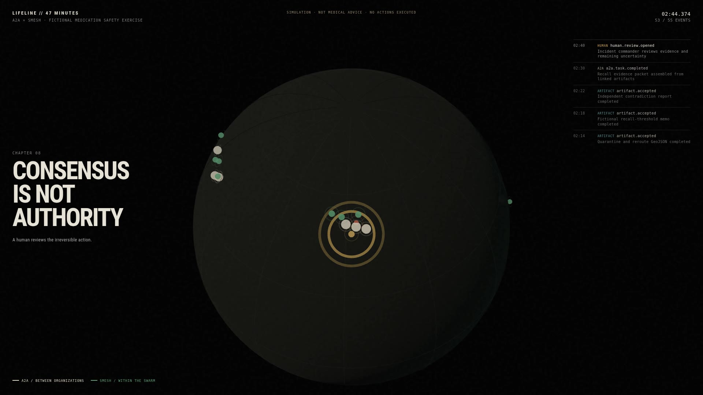

# SMESH A2A

A2A v1 interoperability gateway for decentralized [SMESH](https://github.com/copyleftdev/smesh-rust) agent swarms.

SMESH remains the internal coordination substrate: signals diffuse, decay, reinforce, and accumulate attestations. A2A is the public contract for discovery, durable task lifecycle, streaming progress, cancellation, and artifacts.

## What works

- Official A2A v1 Rust types and server/client SDKs
- Public Agent Card at `/.well-known/agent-card.json`
- JSON-RPC endpoint at `/jsonrpc`
- HTTP+JSON/REST endpoint at `/rest`
- Synchronous and SSE streaming task execution
- `GetTask`, `ListTasks`, `SubscribeToTask`, and `CancelTask` through `a2a-rs`
- Strict inline-text validation with a 64 KiB default limit
- Translation to a real `smesh_core::SignalType::Query`
- Injectable `MeshDispatcher` boundary for a production SMESH runtime
- Deterministic loopback worker for demos and interoperability tests
- Official-client LIFELINE Response Director with concurrent commissioning, reconnect,
  bounded cancellation, logistics fallback, independent review, and ID-complete run records
- Five isolated organization-local LIFELINE `SmeshRuntime` teams behind six A2A gateways, with
  deterministic claim reinforcement, backoff, signed contradiction linkage, decay, and private
  bounded semantic journals plus genuine runtime event traces
- Bounded task retention, execution concurrency, event/artifact counts, and output bytes
- Worker inactivity, cancellation, and command-channel deadlines
- Terminal-state and task-ID reuse guards
- Mandatory versioned completion policy with buffered candidate artifacts, contradiction veto,
  deterministic receipt claims, and optional signed human ratification
- HMAC sealing and read-path validation for accepted completion receipts; SQLite mode persists the
  sealing key with the task ledger so receipts remain verifiable after restart
- Versioned artifact manifests, exact plaintext SHA-256 digests, fixed 4 MiB chunks, manifest-only
  A2A projections, envelope AES-256-GCM hooks, and a private immutable POSIX blob backend
- PostgreSQL revision 5 catalog for task-bound opaque artifact references, provenance, promotion,
  read leases, legal holds, key-generation audits, tombstones, and fenced GC jobs
- Bounded full-matrix capture adapters with private create-new, write-and-sync tagged JSONL lifecycle
  spools, explicit durable completion/failure, source-local producer identity/sequences, causal
  validation, and pure offline replay
- Deterministic distributed causal merge with producer-supplied HLC/Lamport facts, pending-parent
  resolution, contiguous producer chains, restricted-JCS canonical JSONL, Merkle run seals,
  recorded-only projection/replay receipts with supplied-receipt/pinned-seal verification,
  Unix-only owner-private absolute-path create-new persistence with fail-closed unsupported-platform
  behavior and state-bound interrupted-temporary reconciliation that never deletes a possible sole
  published copy, and independent Rust/Node source-merge
  golden vectors plus Unicode/u64 canonicalization corpus
- Bounded pre-persistence trace privacy for strict JSONL (or one explicitly supplied JSON object):
  six closed data classes, secret removal, typed placeholders, run-scoped HMAC handles, exact
  RFC 6901 action logs with record indices, semantic leak scanning, and separate public/restricted
  manifests with keyed public commitments for restricted metadata

The production artifact path requires PostgreSQL metadata authority, an owner-private absolute POSIX
root, and an explicit key generation selected by the runtime. With those settings, receiver output is
staged, transactionally registered with the fenced receiver completion, promoted by bounded workers,
and served only through authenticated GET/HEAD resolution. Startup fails closed for incomplete restore
journals and invalid catalog/manifest/object relationships. SQLite remains the local task-ledger
backend and does not claim external-artifact production parity. See
[`docs/ARTIFACT_RUNBOOK.md`](docs/ARTIFACT_RUNBOOK.md).

Physical backup/restore supports a sealed zero-object inventory, rejects every non-empty target
authority table, authenticates all ciphertext before metadata import, and makes `clonePolicy` explicit.
Sealed-backup key dependencies are enforced on live reload and restart until release/expiry.

## Architecture

```text
A2A client
   |
   v
Agent Card + JSON-RPC/REST/SSE
   |
   v
SmeshExecutor -- validates and translates
   |
   v
MeshDispatcher
   |-- LoopbackDispatcher (demo/tests)
   `-- ChannelDispatcher -> RuntimeWorker -> SmeshRuntime/QUIC
   |
   v
SMESH Query signal -> claims/review/tests/consensus -> MeshEvent stream
```

See:

- [`docs/PLAN.md`](docs/PLAN.md)
- [`docs/ARCHITECTURE.md`](docs/ARCHITECTURE.md)
- [`docs/ADR-0001-RUNTIME-PROCESS-OWNERSHIP.md`](docs/ADR-0001-RUNTIME-PROCESS-OWNERSHIP.md)
- [`docs/PROTOCOL_MAPPING.md`](docs/PROTOCOL_MAPPING.md)
- [`docs/RUNTIME_E2E_HARNESS.md`](docs/RUNTIME_E2E_HARNESS.md)
- [`docs/RUNTIME_EVENT_CAPTURE.md`](docs/RUNTIME_EVENT_CAPTURE.md)
- [`docs/RUNTIME_TERMINAL_RACES.md`](docs/RUNTIME_TERMINAL_RACES.md)
- [`docs/ULTIMATE_DEMO.md`](docs/ULTIMATE_DEMO.md)
- [`docs/TRACE_CAPTURE.md`](docs/TRACE_CAPTURE.md)
- [`docs/LIFELINE_TOPOLOGY.md`](docs/LIFELINE_TOPOLOGY.md)
- [`docs/LIFELINE_DIRECTOR.md`](docs/LIFELINE_DIRECTOR.md)
- [`docs/LIFELINE_TEAMS.md`](docs/LIFELINE_TEAMS.md)
- [`evidence/m1/README.md`](evidence/m1/README.md)

The issue #23 capture surface is intentionally adapter-level rather than installed across every gateway
router. `CanonicalCapture::create_spool` is the durable mode; `CanonicalCapture::new` is only an in-memory
test/schema collector. Durable spools must be explicitly `complete` before replay or ingestion; missing
completion and failure records reject the whole prefix. The focused suite drives direct interceptor
schema hooks plus the cancellation-safe
unary wrapper, pinned SMESH runtime/journal types, tool closure, artifact bytes, console I/O, replay
sabotage, and a two-process/all-adapter canonical JSONL run:

```bash
cargo test --test full_matrix_capture
```

The pinned A2A server interceptor abstraction does not cover streaming response frames and is not wired
into all topology/director paths by issue #23. Issue #24's distributed merge consumes only explicit
`full-matrix-causal-source/1` envelopes and does not infer ordering metadata from legacy spools. See
the implemented protocol, limits, hash preimages, persistence guarantees, and issue #25 boundary in
[`docs/TRACE_CAPTURE.md`](docs/TRACE_CAPTURE.md).

Issue #25 is implemented by `trace_privacy`. `sanitize_public_trace` accepts either strict JSONL
(one object per nonblank line, mandatory terminal LF) or one compact JSON object with no LF. It
classifies and transforms every record before callers persist public bytes. Public export is rejected
for unclassified values, unmatched/duplicate/malformed rules, unsafe overlapping transforms,
unsupported class/action pairs, duplicate object keys, or semantic scanner findings. Non-public
object-member names receive
separately domain-separated run/policy-scoped HMAC labels. Versioned policies bind their policy ID,
revision, and HMAC key
generation into handles and both manifests. Exact issue #24 receipts remain restricted; the public
manifest carries only scanned projector metadata and run/policy/key-generation-bound HMAC commitments.
`verify_sanitized_trace` reruns the complete projection from
restricted source bytes instead of trusting manifest-controlled run or receipt fields. The LIFELINE
public writer scans the complete JSONL before creating, truncating, or altering its destination.
Restricted originals are not
persisted or encrypted by this module; use the existing encrypted artifact authority under the
restricted manifest policy.

## LIFELINE cinematic demo

`LIFELINE // 47 MINUTES` is the proposed ultimate use case: six fictional organizations coordinate a medication-safety response without pooling private memory or granting an AI authority to act. The 47-minute fictional response is compressed into a three-minute replay. A2A carries accountable work between organizations; SMESH coordinates uncertain work inside each organization; a human ratifies the final response package.



- [Open the interactive WebGL replay](https://copyleftdev.github.io/smesh-a2a/)
- [Download the narrated film and ElevenLabs master](https://github.com/copyleftdev/smesh-a2a/releases/tag/lifeline-demo-v0.1)

The repository includes a deterministic cinematic fixture and replay surface:

- `demo/lifeline.trace.jsonl`: 55 append-only, hash-chained events
- `demo/trace.schema.json`: the replay schema
- `demo/index.html`: interactive Three.js/WebGL globe, timeline, scrubber, and trace inspector
- `demo/STORYBOARD.md`: the 16:9 film plan
- `demo/NARRATION.md`: timed ElevenLabs-ready narration
- `demo/lifeline-voiceover.mp3`: bundled narration used by the interactive Play control
- `demo/export-film.mjs`: deterministic frame-by-frame exporter
- `demo/record-film.mjs`: real-time 1920×1080 recorder and audio muxer

Generate and validate the trace:

```bash
cargo run --bin lifeline-trace -- demo/lifeline.trace.jsonl
cargo test --test lifeline_trace
```

Preview the WebGL film:

```bash
cd demo
npm ci
npm run serve
# open http://127.0.0.1:43130/
```

The checked-in JSONL is a deterministic synthetic fixture for replay, design, and conformance work. The nominal visual timeline is three minutes; the current narrated master is approximately 2:55 because export stops at the end of the narration track. It does not claim that six production organizations or six live SMESH runtimes executed the incident. The operational version must replace fixture emission with captured A2A requests, real `SignalType::Query` diffusion, dispatcher acknowledgements, task-ledger transitions, and human approval events. The film is permanently labeled `SIMULATION · NOT MEDICAL ADVICE · NO ACTIONS EXECUTED`.

Issue #20 adds the first operational prerequisite: six fictional organization-specific A2A cards and a deterministic local deployment topology. Northstar's Director resolves five primary remote gateways plus an independently addressed Atlas logistics fallback:

```bash
cargo run --bin lifeline-topology -- deploy/lifeline-topology.json
```

The official Rust `AgentCardResolver` discovers every real listener in the integration suite. Cards expose only bounded public capabilities and explicitly grant no trust, authorization, clinical validation, or action authority. The local topology deliberately uses no authentication and cannot bind non-loopback addresses; it is not the Response Director or a production deployment. See [`docs/LIFELINE_TOPOLOGY.md`](docs/LIFELINE_TOPOLOGY.md).

## Run the gateway

Requires Rust 1.88 or newer.

```bash
SMESH_A2A_AUTH_MODE=disabled cargo run --bin smesh-a2a-gateway
```

Defaults:

- bind: `127.0.0.1:3000`
- public URL: `http://127.0.0.1:3000`
- node ID: `smesh-a2a-gateway`
- mode: `loopback`
- OTLP: disabled

Observability is configured with `SMESH_A2A_OTLP_MODE=grpc|http-protobuf` and a strict root
`SMESH_A2A_OTLP_ENDPOINT`. Enabled production endpoints require HTTPS; debug tests may opt into a
literal plaintext loopback collector with `SMESH_TEST_OTLP_INSECURE_LOOPBACK=1`. Export runs on an
isolated bounded owner and is optional: collector absence, reset, or shutdown timeout cannot change
protocol or durable-authority results. Ingress replaces caller `x-request-id` and ignores
`traceparent`, `tracestate`, and `baggage` as authority. See
[`docs/OBSERVABILITY_RUNBOOK.md`](docs/OBSERVABILITY_RUNBOOK.md), the bootstrap objectives,
Prometheus rules, Grafana dashboard, and normalized OTLP fixture under `observability/`.

Configuration:

```bash
mkdir -p "$HOME/.local/state/smesh-a2a"
chmod 700 "$HOME/.local/state/smesh-a2a"
SMESH_A2A_BIND=127.0.0.1:4000 \
SMESH_A2A_PUBLIC_URL=http://127.0.0.1:4000 \
SMESH_A2A_NODE_ID=gateway-west \
SMESH_A2A_AUTH_MODE=disabled \
SMESH_A2A_DURABLE_BACKEND=sqlite \
SMESH_A2A_SQLITE_PATH="$HOME/.local/state/smesh-a2a/tasks.sqlite3" \
cargo run --bin smesh-a2a-gateway
```

`SMESH_A2A_SQLITE_PATH` enables repository-owned durable admission, dispatch, receiver deduplication,
and exact unary/stream replay **only when `SMESH_A2A_MODE=loopback`** (the default). Persistent
SQLite mode is supported on Unix platforms only and enforces exactly one open writer per database
with a nonblocking lifetime file lock; a second gateway/store open fails before restart recovery and
cannot terminalize live work. On non-Unix platforms persistent open fails explicitly. The path must
be absolute and its existing parent directory must be owned by the gateway user with no group or
world permissions (normally mode `0700`). The database and SQLite sidecars are held at `0600`.
On SIGINT, durable loopback stops HTTP admission gracefully, joins its outbox driver and real-time
retry ticker within bounded deadlines, then closes shared SQLite state and releases the lock.

When OIDC or optional/required mTLS is enabled, `SMESH_A2A_AUTHORIZATION_POLICY_PATH` and an
explicit durable backend are mandatory. The production binary accepts authentication and tenant
authorization only as one combined boundary, validates policy before listener/SQLite/runtime/mesh
acquisition where possible, and routes protected JSON-RPC/REST operations through the schema-v6
tenant/owner predicates and durable authorization audit. A policy with authentication disabled,
authentication without policy, or authenticated non-loopback serving fails closed.

Production PostgreSQL replicas set `SMESH_A2A_DURABLE_BACKEND=postgres`, distinct TLS
`SMESH_A2A_POSTGRES_MIGRATOR_URL` and `SMESH_A2A_POSTGRES_RUNTIME_URL`,
`SMESH_A2A_POSTGRES_SCHEMA`, and the mandatory strict startup snapshot
`SMESH_A2A_QUOTA_POLICY_PATH`. `SMESH_A2A_REPLICA_ID` is optional; it must be a bounded ASCII
identifier and otherwise a random boot identifier is generated. SQLite and PostgreSQL settings may
not be mixed, and configuring distributed quotas with SQLite fails before resource acquisition.
PostgreSQL claims and renewals use database time and complete fences; durable polling is the
cross-replica correctness path. Revision 4 adds tenant-leading fixed-window buckets, active-work
allocations, immutable multi-dimensional intent receipts, bounded denial/override audit tables, RLS,
and scope-leading indexes. The live authorized create/send-stream admission path derives tenant,
account, and principal only from `AuthorizationContext`, resolves the server policy snapshot, and
charges tenant, account, and principal request/input/active-work dimensions atomically with workflow state.
Caller headers, metadata, JSON-RPC IDs, and clocks cannot construct or raise the intent. Exact replay
verifies the original binding without recharging; terminal/pause transitions release active work once.
Quota exhaustion is JSON-RPC `-32010` / REST 429 and authority unavailability is `-32011` / REST 503.
See [`evidence/m2/issue-14.md`](evidence/m2/issue-14.md) for the completed distributed-quota
surface, exact RED/GREEN evidence, focused abuse/fairness/failover matrix, and explicit
boundaries with artifact storage (#15), observability (#16), push callbacks (#17), and broad
fuzz/load/chaos qualification (#18).
Debug CI runs the plaintext local-fixture child-process PostgreSQL failover, durable SSE, renewal,
crash reconciliation, restart replay, renewal-outage recovery, and full production-binary E2E. The
plaintext and shortened-lease seams do not exist in release. Release CI instead runs the complete
all-target/all-feature suite and proves the production binary rejects plaintext PostgreSQL with
`TlsRequired` before listener/database acquisition; a trusted-CA release PostgreSQL E2E is not
currently provisioned. See [`docs/POSTGRES_TENANT_SCHEMA.md`](docs/POSTGRES_TENANT_SCHEMA.md),
[`docs/TENANT_AUTHORIZATION_RUNBOOK.md`](docs/TENANT_AUTHORIZATION_RUNBOOK.md) and
[`evidence/m2/issue-13.md`](evidence/m2/issue-13.md). Authentication-only library builders remain
explicit development compatibility APIs and are not multitenant-safe.

`ListTasks` uses expiring frozen-snapshot pagination. Page one fixes authorized membership,
canonical order (`statusTimestamp` present first and descending, then task ID ascending), projected
task JSON, and a constant `totalSize`; later inserts and updates cannot enter, disappear from, move,
or alter that chain. Tokens are opaque HMAC-derived URL-safe capabilities (no tenant/account/filter/ID
plaintext), are reusable for retry, and persist only as hashes in SQLite. Snapshot metadata is also
HMAC-bound to every ordered frozen entry and the complete expected token-position chain. The
in-memory bounded store
provides the same snapshot semantics but intentionally invalidates tokens when the process/store is
recreated.

`SMESH_A2A_MODE=runtime` combined with `SMESH_A2A_SQLITE_PATH` fails closed before opening SQLite,
starting the runtime/event drain or worker, or binding/joining the mesh. Durable runtime routing is not
supported until a repository-owned runtime effect-idempotency adapter can durably deduplicate stable
dispatch IDs and replay receiver effects. The generic library function `build_router_with_sqlite`
(and its traced variant) remains a compatibility/task-snapshot API around the upstream
`DefaultRequestHandler`; it is not durable dispatch and must not be used to claim effect replay.

Run the built-in real runtime worker with a live QUIC endpoint:

```bash
SMESH_A2A_MODE=runtime \
SMESH_A2A_AUTH_MODE=disabled \
SMESH_A2A_MESH_BIND=127.0.0.1:4100 \
SMESH_A2A_BOOTSTRAP=127.0.0.1:4101,127.0.0.1:4102 \
cargo run --bin smesh-a2a-gateway
```

`SMESH_A2A_BOOTSTRAP` may be omitted for the first mesh node. Runtime mode creates a genuine
`SmeshRuntime`, joins its QUIC mesh, emits each validated request as `SignalType::Query`, and uses
the gateway completion policy as the only authority that can publish artifacts or `Completed`.
The bundled `RuntimeAdmissionProcessor` deliberately supplies no semantic review/test evidence, so
an arbitrary request ends `Failed` with no public artifact after proving real ingress. A trusted
application processor and independent evidence sources are required before semantic completion.

Inspect the Agent Card:

```bash
curl http://127.0.0.1:3000/.well-known/agent-card.json
```

Use the official A2A CLI:

```bash
cargo install a2a-cli
a2acli --base-url http://127.0.0.1:3000 card
a2acli --base-url http://127.0.0.1:3000 send "review this Rust crate"
a2acli --base-url http://127.0.0.1:3000 stream "review this Rust crate"
```

## Embed a custom runtime task processor

`RuntimeWorker` owns `ChannelDispatcher` commands and the genuine SMESH ingress path. Inject a
processor only for application-specific Query→candidate work; its events remain untrusted policy
inputs:

```rust,no_run
use std::sync::Arc;
use smesh_a2a::{RuntimeAdmissionProcessor, RuntimeWorker};
use smesh_runtime::SmeshRuntime;

# async fn example(runtime: Arc<SmeshRuntime>) -> Result<(), Box<dyn std::error::Error>> {
let (dispatcher, worker) = RuntimeWorker::spawn(
    runtime,
    "gateway-node",
    RuntimeAdmissionProcessor,
    64,
).await?;
# let _ = dispatcher;
# let _ = worker;
# Ok(())
# }
```

The bundled processor proves structural runtime ingress and binding only. It does not claim the
requested work is semantically correct or independently reviewed.

## Security posture

The gateway is localhost-first by default. Multi-tenant PostgreSQL and reviewed internet exposure are
available only inside the documented transport/authentication/operator boundary; this pre-stable release
is not a general production-readiness claim.

- URL and raw file parts are rejected; the gateway never dereferences user-provided URLs.
- Push callbacks are disabled by default. Production enablement requires an enrolled canonical HTTPS
  DNS policy, fresh all-answer special-use rejection, pinned TLS/mTLS, exact signing, quotas, bounded
  retry/fencing, and stable idempotency.
- External metadata cannot set SMESH trust, confidence, reinforcement, or node identity.
- Agent Card data is discovery metadata, not an attestation.
- Input is bounded before entering the mesh (128 KiB HTTP body, 64 KiB text).
- The local store has a hard 1,024-task ceiling; active execution defaults to 64 tasks.
- Worker output is limited to 16 events, 16 artifacts, and 1 MiB per task.
- Worker inactivity, total task duration, and cancellation have deadlines; cancellation wakes active streams.
- Worker `Completed` events are proposals: candidate artifacts remain private until the
  gateway's locally configured completion policy accepts a sealed evidence snapshot.
- Non-loopback binds require `direct-tls`, an HTTPS public URL, and OIDC and/or required mTLS.
  `SMESH_A2A_UNSAFE_PUBLIC` is ignored and cannot bypass transport or authentication policy.

OIDC bearer authentication is required by default; an absent `SMESH_A2A_AUTH_MODE` behaves as
`oidc`. Startup fails before listener, SQLite, runtime, or JWKS resources are initialized when the
required OIDC settings are missing. Explicit `SMESH_A2A_AUTH_MODE=disabled` is permitted for
loopback local development or for direct TLS when required mTLS is the sole authentication method.
OIDC mode validates RFC 9068 RS256 access tokens against an eagerly
fetched, bounded HTTPS JWKS and supplies an immutable, request-scoped principal to all handler
methods and deferred stream polls. The public Agent Card advertises the bearer requirement. See
[`docs/OIDC_KEY_ROTATION_RUNBOOK.md`](docs/OIDC_KEY_ROTATION_RUNBOOK.md).

Direct rustls termination supports disabled, optional, or required client authentication. Verified
leaf-certificate DER is SHA-256 fingerprinted and exact-matched against a bounded principal map;
CN, SAN, forwarding headers, and protocol metadata never establish identity. Optional mTLS permits a
valid bearer when no certificate is presented, but a verified unmapped certificate never falls back
to bearer. Bearer and mTLS identities presented together must have identical issuer and subject.
SIGHUP atomically reloads the complete certificate, key, client roots, and map generation. See
[`docs/TLS_MTLS_ROTATION_RUNBOOK.md`](docs/TLS_MTLS_ROTATION_RUNBOOK.md).

## Test and verify

```bash
cargo fmt --all -- --check
cargo clippy --all-targets --all-features -- -D warnings
cargo test --all-features
cargo doc --no-deps
```

The integration suite starts real Axum and QUIC listeners and drives the gateway with the official
A2A Rust client. It verifies real runtime Query ingress, fail-closed admission-only output,
streaming order, and cancellation acknowledgement after runtime processing stops.

## A2A client SDK TLS limitation (a2a-client-lf 0.2.2)

The official SDK's `A2AClientFactory::builder()` does not expose a custom `reqwest::Client` or a direct custom-root option for its default transports. Custom private roots require low-level composition: build the SDK HTTP client with `a2a_client::default_reqwest_client(Some(root_pem))`, pass it to `AgentCardResolver::new(Some(client))`, disable factory defaults, and register explicit JSON-RPC/REST transport factories with that client. The SDK helper does not provide client-identity (mTLS) configuration, so the checked real mTLS socket evidence in this repository uses a separately configured `reqwest` client and is intentionally **not** described as official-client interoperability evidence.

## License

MIT OR Apache-2.0.
